# 👋 Hello, I'm **Kamlesh Choudhary** 

<div align="center">

[](https://github.com/seerviK)
[](https://github.com/seerviK?tab=followers)
[](https://github.com/seerviK)

</div>

<div align="center">
  
</div>

---

## 🎯 **About Me**

```javascript
const kamlesh = {
    location: "🇮🇳 Pune, India",
    education: "🎓 B.Tech Computer Science - Vishwakarma University",
    currentFocus: ["Full Stack Development", "Machine Learning", "System Programming"],
    askMeAbout: ["Web Development", "Python", "JavaScript", "C/C++", "Database Design"],
    technologies: {
        frontEnd: ["React.js", "HTML5", "CSS3", "JavaScript"],
        backEnd: ["Node.js", "Express.js", "Python"],
        databases: ["MongoDB", "MySQL"],
        tools: ["Git", "GitHub", "Docker", "VS Code", "PowerBI"],
        languages: ["Python", "JavaScript", "C", "C++", "Java", "R"]
    },
    hobbies: ["🎮 Gaming", "📚 Learning New Tech", "🎵 Music", "💻 Coding"],
    motto: "Code, Learn, Build, Repeat! 🔄"
};
```

---

## 🛠️ **Tech Stack & Tools**

<div align="center">

### **Programming Languages**


### **Frontend Development**


### **Backend Development**


### **Databases**


### **Machine Learning & AI**


### **Tools & Platforms**


</div>

---

## 📊 **GitHub Analytics**

<div align="center">


</div>

<div align="center">

[](https://github.com/seerviK)

</div>

---

## 🚀 **Featured Projects**

```mermaid
graph TD
    A[🏠 My Projects] --> B[🎮 Games]
    A --> C[🌐 Web Applications]
    A --> D[🤖 AI/ML Projects]
    A --> E[💼 Management Systems]
    A --> F[📊 Analytics]
    
    B --> B1[🍭 Candy Crush Game]
    B --> B2[🐦 Flappy Bird Game] 
    B --> B3[🦘 Doodle Jump Game]
    
    C --> C1[🎵 Spotify Clone]
    C --> C2[🎓 Education Consultancy]
    C --> C3[🔧 Garage Management]
    
    D --> D1[👤 Face Recognition Attendance]
    D --> D2[🛡️ DDoS Detection System]
    
    E --> E1[📦 Inventory Management]
    
    F --> F1[👥 HR Analytics Dashboard]
    
    style A fill:#ff6b6b,stroke:#000,stroke-width:3px,color:#fff
    style B fill:#4ecdc4,stroke:#000,stroke-width:2px,color:#fff
    style C fill:#45b7d1,stroke:#000,stroke-width:2px,color:#fff
    style D fill:#f39c12,stroke:#000,stroke-width:2px,color:#fff
    style E fill:#9b59b6,stroke:#000,stroke-width:2px,color:#fff
    style F fill:#2ecc71,stroke:#000,stroke-width:2px,color:#fff
```

<div align="center">



</div>

### 🎮 **Gaming Projects**
| Project | Tech Stack | Stars | Forks | Description |
|---------|------------|-------|-------|-------------|
| [🭠Candy Crush Game](https://github.com/seerviK/Candy-Crush-Game-) |  | ⭠2 | 🴠1 | Interactive puzzle game with colorful animations |
| [🦠Flappy Bird Game](https://github.com/seerviK/Flappy-Bird-game) |  | ⭠2 | 🴠0 | Classic arcade-style game with smooth controls |
| [🦘 Doodle Jump Game](https://github.com/seerviK/Doodle-jump-game) |  | ⭠2 | 🴠0 | Endless jumping adventure game |

### 🌐 **Web Applications**
| Project | Tech Stack | Stars | Forks | Description |
|---------|------------|-------|-------|-------------|
| [🵠Spotify Clone](https://github.com/seerviK/Spotify-Clone) |    | ⭠2 | 🴠1 | Music streaming platform replica |
| [📠Education Consultancy](https://github.com/seerviK/Education-Consultancy-Website) |  | ⭠2 | 🴠0 | Complete education consultancy solution |
| [🔧 Garage Management](https://github.com/seerviK/Garage-Management-System-Website-) |   | ⭠2 | 🴠1 | Full-stack garage management system |

### 🤖 **AI/ML Projects**
| Project | Tech Stack | Stars | Forks | Description |
|---------|------------|-------|-------|-------------|
| [👤 Face Recognition Attendance](https://github.com/seerviK/Student-Attendance-Face-Recognition-) |   | ⭠2 | 🴠1 | Smart attendance system using facial recognition |
| [🛡️ DDoS Detection System](https://github.com/seerviK/DDoS-Detection-System) |   | â­ 1 | 🴠0 | Network security system with ML algorithms |

### 💼 **Management & Analytics**
| Project | Tech Stack | Stars | Forks | Description |
|---------|------------|-------|-------|-------------|
| [📦 Inventory Management](https://github.com/seerviK/Inventory-Management-System) |  | ⭠2 | 🴠0 | Complete inventory tracking solution |
| [👥 HR Analytics Dashboard](https://github.com/seerviK/HR-Analytics-Dashboard) |  | ⭠1 | 🴠0 | Interactive HR data visualization |

### 💻 **System Programming**
| Project | Tech Stack | Stars | Forks | Description |
|---------|------------|-------|-------|-------------|
| [âš™ï¸ System Programming](https://github.com/seerviK/System-Programming) |  | â­ 2 | 🴠0 | Low-level system programming concepts |
| [🨠Graphics in C](https://github.com/seerviK/graphics_in_C) |  | ⭠2 | 🴠1 | Computer graphics programming |

---

## 🌱 **Learning Journey**

<div align="center">


</div>

### 🎯 **Current Focus Areas**
- 🌐 **Full Stack Development**: Enhancing MERN stack skills
- 🤖 **Machine Learning**: Building intelligent systems with Python
- 🛠️ **System Programming**: Low-level programming and optimization
- ☁️ **Cloud Technologies**: Exploring AWS and Docker containers
- 📊 **Data Analytics**: Advanced data visualization and insights

---

## 🏆 **Achievements & Stats**

<div align="center">

### 📈 **GitHub Contribution Graph**


### 🏅 **GitHub Profile Trophy**
[](https://github.com/seerviK)

</div>

---

## 🤝 **Let's Connect**

<div align="center">

[](https://www.linkedin.com/in/kamlesh-choudhary-775512257)
[](https://www.instagram.com/kamleshchoudhary_100/)
[](mailto:kamleshchoudhari123456@gmail.com)
[](https://github.com/seerviK)

</div>

---

## 📊 **Weekly Development Breakdown**

<!--START_SECTION:waka-->
```text
JavaScript   8 hrs 45 mins   ████████████░░░░░░░░░░░░░   48.2%
Python       4 hrs 32 mins   ██████░░░░░░░░░░░░░░░░░░░   25.1%
C++          2 hrs 15 mins   ███░░░░░░░░░░░░░░░░░░░░░░   12.4%
HTML/CSS     1 hr 48 mins    ██░░░░░░░░░░░░░░░░░░░░░░░   10.0%
Java         0 hrs 47 mins   █░░░░░░░░░░░░░░░░░░░░░░░░   4.3%
```
<!--END_SECTION:waka-->

---

## 🎯 **2025 Goals**

<div align="center">


</div>

---

## 💡 **Fun Facts**

<div align="center">

🎮 **Gaming Enthusiast** - Love creating and playing games  
🌟 **Always Learning** - Currently exploring new web frameworks  
☕ **Coffee Powered** - Best code written with a good cup of coffee  
🎵 **Music Lover** - Code better with lo-fi beats  
🚀 **Innovation Driven** - Always looking for creative solutions  

</div>

---

## 📈 **Contribution Stats**

<div align="center">


</div>

---

<div align="center">

### 🌟 **"Code is poetry written in logic"** 🌟

[](https://github.com/seerviK)
[](https://github.com/seerviK)

---

**Thank you for visiting my profile! 🚀**  
*Let's build something amazing together!* 💻✨

</div>
